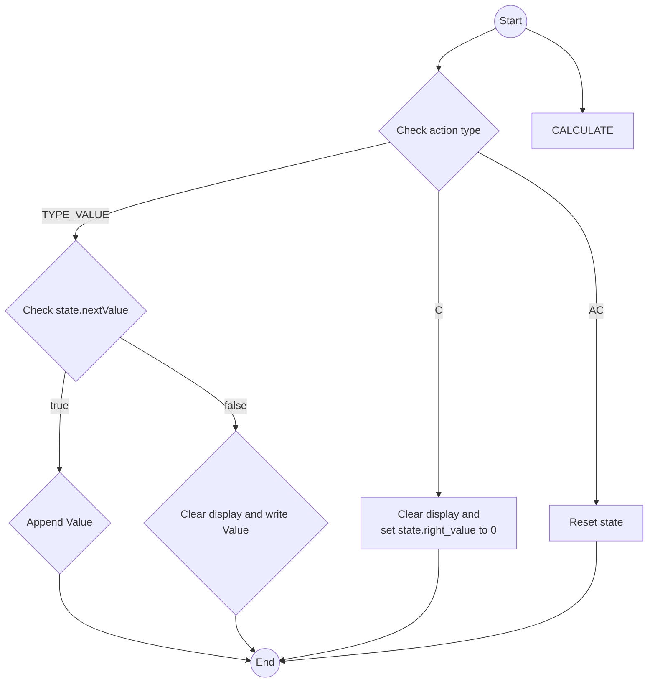

# numberDisplayed Reducer's Flow Chart (WIP)

```mermaid
graph TB
  start((Start))
  endd((End))
  start-->action_type{Check action type}
  action_type-- TYPE_VALUE -->type_value_if{Check state.nextValue}
    type_value_if-- true -->append_value{Append Value}
    type_value_if-- false -->write_value{Clear display and write Value}
    append_value-->endd
    write_value-->endd
  action_type-- C -->clear_display[Clear display and<br>set state.right_value to 0 ]
    clear_display-->endd
  action_type-- AC -->reset_state[Reset state]
    reset_state-->endd
  start-->calculate[CALCULATE]
```

